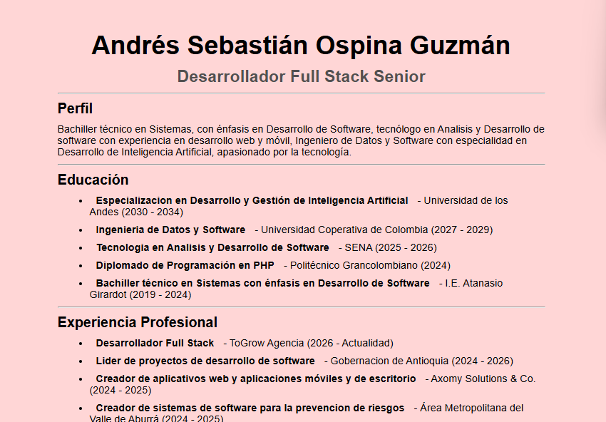

# Construcción de un CV modular con React
## Componentes, anidación y control de versiones

Este documento describe la creación de un Currículum Vitae (CV) utilizando React, enfocándose en la construcción modular de componentes, la organización jerárquica (anidación) y el uso de control de versiones para gestionar el desarrollo del proyecto.

Para ver el CV, deberas de ejecutar el siguiente comando en la terminal:
```
npm run dev
```

Posteriormente a ello, deberas de abrir el navegador y dirigirte a la siguiente dirección:
```
http://localhost:5173/
```

